# Youtube Shared Subscriber Bubbles

This is a program to generate three different types of graphs of shared subscribers with other youtubers. The intended users of the program are YouTubers themselves, not viewers. 

---

## Table of Contents

- [About](#about)
- [Installation](#installation)
- [Usage](#usage)
- [Configuration](#configuration)
- [How to use the program](#how-to-use-the-program)
- [Contact](#contact)

---

## About

The three types of graphs are a [star graph](https://en.wikipedia.org/wiki/Star_(graph_theory)), [complete graph](https://en.wikipedia.org/wiki/Complete_graph) and a star graph showing the ratio of 'shared subscribers' to 'subscribers'.

If you want to check out some of the graphs created you can find them in Finished Graphs/Rendered

The program first fetches subscribers of your channel, for this you need to allow the program to access some of your youtube data which it will ask to do. Next up using your subscribers it fetches who they are subscribed to, and using this data it creates all the data for the graphs.

To generate the graphs you need the use the open graph software [gephi](https://gephi.org/). A tutorial on how to use it will follow in this README file. 


---

## Installation

```bash
# Example installation commands
git clone https://github.com/abbindustrigymnasium/nskeprojekt-youtubesubscriberbubble-simmei.git
cd nskeprojekt-youtubesubscriberbubble-simmei
```

---

## Usage

To run the project you need a few installs before it can run.

```pip

pip install colorama
pip install google-api-python-client
pip install google-auth-oauthlib

```

Now you can run the project by opening a terminal, navigating to the /nskeprojekt-youtubesubscriberbubble-simmei/project folder and run:

```
python program_better.py
```
or (the program_old is not writen about in this read.me. I still kept it in the project though as it is easier to understand compared to the new program.)
```
python program_old.py
```

---

## Configuration

To fetch data you need to set up a Google Youtube API account.

Here is a tutorial on how to set it up: [youtubeApi](https://www.youtube.com/watch?v=TE66McLMMEw)

You will need two different api's. One normal api key and one OAuth 2.0 Client IDs. Once you have these please put the api key in the Project/api/api.json.

The OAuth 2.0 Client IDs should be renamed to secret.json and be put in the same Project/api/ folder

---

## How to use the program

This project already includes a lot of prefetched data from the @Swinceball channel. If you want to fetch your own data I advise removing all .json and .csv files in the storage folder and it's sub folders. You can also remove the pre-generated GephiFiles in generatedGephiFiles/

### Steps to fetch data

For this step you need the google API, (if you are my teacher and want to run this program skip to the next chapter, as you won't be able to run this.)

Run 'fetchPrimary | fs' to fetch around 1000 channels that are subscribed to your youtube channel. A google popup will open on your browser, and you need to allow the program to fetch the data. This data will be stored in storage/firstSubs/channels.csv. 

Next step is to run 'fetchSecondary | fs' which loops through every channel from the first step and fetches who they are subscribed to. Each subscriber will have their subscriberdata stored in storage/secondarySubs, and a complete list of the amount of shared subscribers will be stored in storage/totalSubs. For this the variable 'subLimit' is important.

If you also want to generate the third ratio graph you need to run 'fetchRatio'. The ratio of every subscriber is stored in storage/subRatio .For this the variable 'ratioSubMininum' is needed.

### Steps to generate graph data

Once all the data has been fetched we can begin generating the graphs. This part can be done without setting up google api, using the data already availible in the project. 

simply run each command to generate each type of graph. Before you do change all the variables. Remember to change the channel name to yours.

All the generated graphdata is stored in generatedGephiFiles.

In the case of the complete graphs I recommend running the 'compEdge | ce' command to edit the data. It will remove all connections between two channels with less than x weight. This way the data is more interesting to look at later. 

### Create Graphs with Gephi

Here follows a tutorial on how to use the program Gephi. 

When opening Gephi start by importing your Node and Edge files. Make sure to choose append to existing workspace

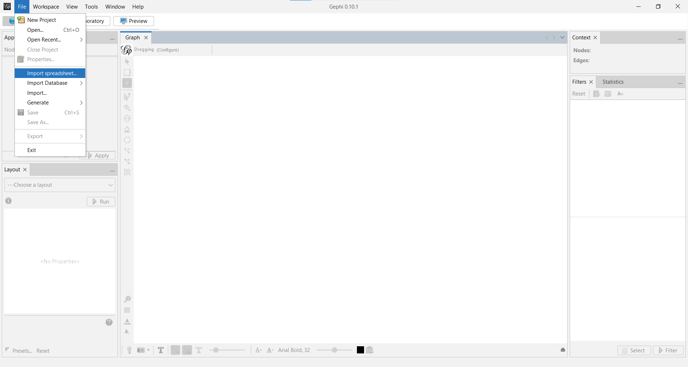

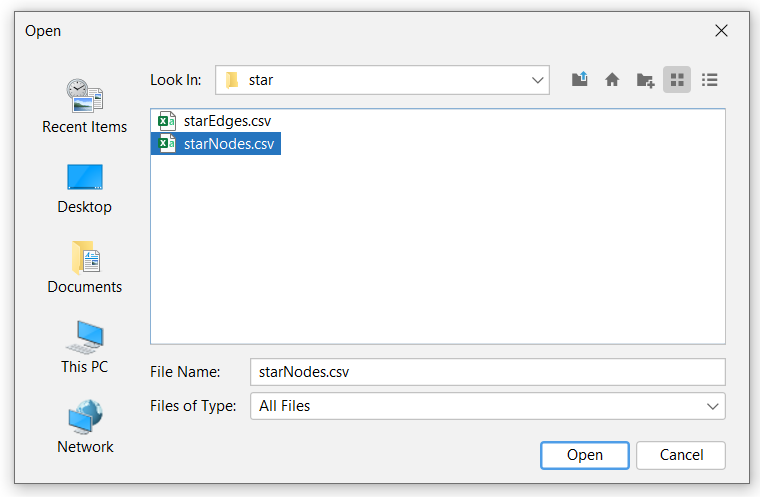

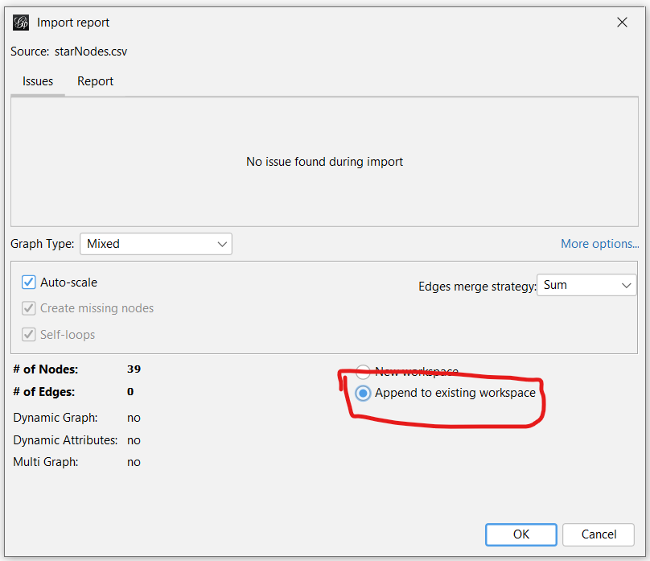

When you have imported the data you should be able to see the data in the data laboratory. If we go back to Overview we can already see the data rendered.

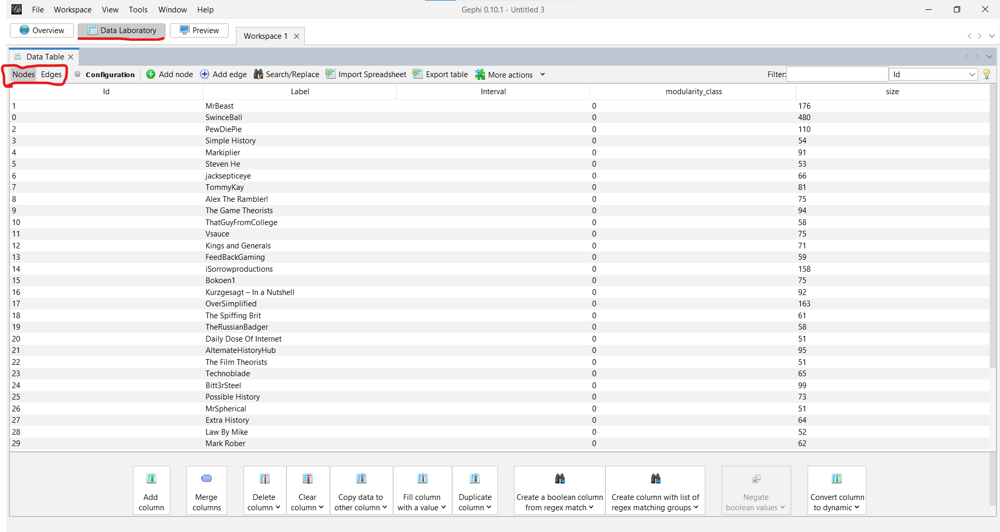

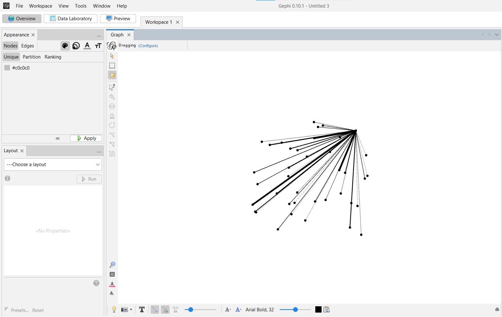

But as we can see everything is black. So in the apperance meny we can begin change this. Selecting number 1 will allow you to change colour. On number 2 you can change size, by choosing Ranking then size, the nodes will be ranked after the size from the data. 

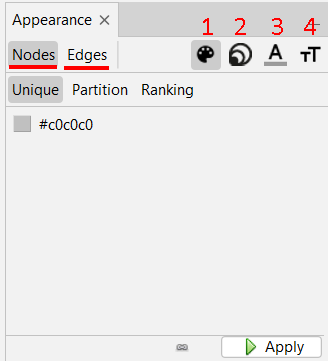

Next up it is time to fix the layout of the diagram by running several algorithems. We start with force atlas 2, with the settings shown in the images. Next up we run Fruchterman Reingold which creates a nice atom structure according to me. Finally we can run the lable adjust.

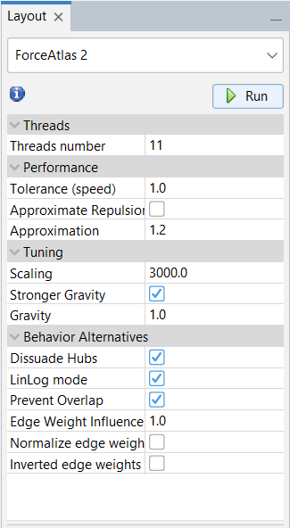

Finally we can go to preview where we can create a nice looking graph and to export it as an SVG/PDF/PNG. You need to refresh.

Now we have the star graph, the complete graph is a bit harder. We start once again by importing the nodes and edges. Then we are going to run a modularity statistics, I suggest running it and changing the resolution until you get around 4-6 communities.

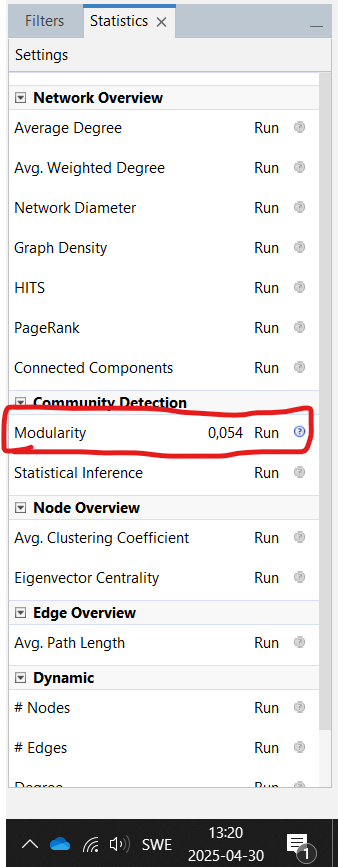

Once we have the communities we can colour the nodes after them. Go to the color meny and choose Partition, then modularity class. We will now run ForceAtlas 2 with the settings shown on the image below. You can of course play around and try different settings until you get something that looks nice. 

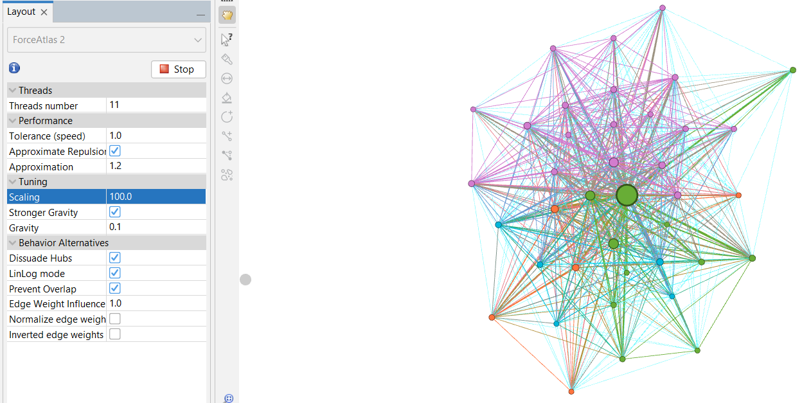

You might however see that some colours are jumbled together. We can make them closer to each other by filtering the diagram after each modularity class. By running the ForceAtlas 2 on each of the classes, the dragging all the nodes so they aren't each on each other. Finally by running force atlas one final time we should get something really nice. 

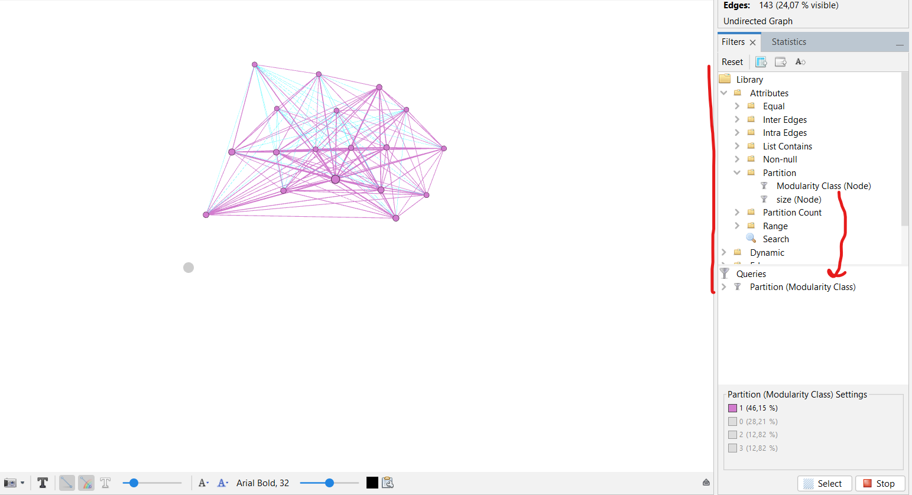

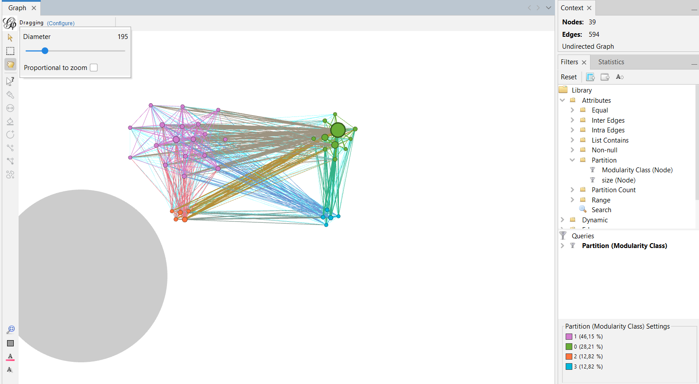

Finally you can go into Preview tab and fix the graph manually making it pretty and finally export it. 

## Contact

If you have any questions feel free to reach out to me on my mail.

Swinceball@gmail.com

